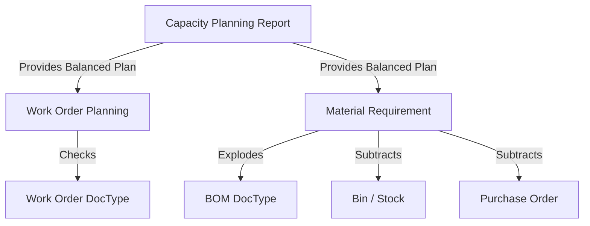

# System Patterns: KTA MRP

## Architecture
Built as a modular extension within the `kta_mrp` app in ERPNext. Uses Python for the calculation engine and Frappe's Script Report framework for the UI.

## Key Technical Decisions
- **Shared Filter Registry**: Centralized filters in `report_utils.py` to ensure consistency across Capacity, Work Order, and Material reports.
- **Backward Pass (Smoothing)**: Implemented a reverse-chronological loop to pull future spikes into previous empty weeks (Ramp-up).
- **Forward Pass (Allocation)**: Implemented a FIFO-first allocation with proportional distribution for remaining capacity.
- **Stateful Carry-over**: Uses a dictionary (`item_carry_over`) to track unfulfilled demand precisely across weeks.

## Design Patterns
- **Delegation**: `Work Order Planning` and `Material Requirement` reports delegate the core demand calculation to `Capacity Planning`.
- **Constraint-Based Planning**: Every allocation is wrapped in a capacity check against the `Item Group`'s `custom_weekly_production`.
- **MOQ Wrapping**: Material net needs are wrapped in a `ceil(shortfall / moq) * moq` function to respect packaging standards.

## Component Relationships

