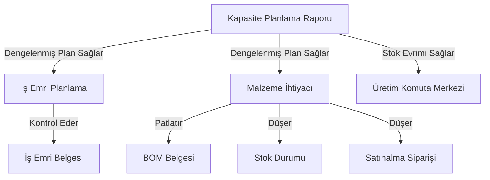

# Sistem Yapıları: KTA MRP

## Mimari
ERPNext içindeki `kta_mrp` uygulaması altında modüler bir eklenti olarak tasarlanmıştır. Hesaplama motoru için Python, kullanıcı arayüzü için Frappe'nin "Script Report" altyapısı kullanılır.

## Temel Teknik Kararlar
- **Ortak Filtre Kaydı**: Kapasite, İş Emri ve Malzeme raporları arasındaki tutarlılığı sağlamak için filtreler `report_utils.py` içinde merkezileştirilmiştir.
- **Geriye Dönük Geçiş (Smoothing)**: Gelecekteki yük patlamalarını boş haftalara çekmek için sondan başa doğru çalışan bir döngü uygulanmıştır (Ramp-up).
- **İleriye Dönük Tahsis (Allocation)**: Kalan kapasite için FIFO (ilk giren ilk çıkar) öncelikli ve oransal dağılım mantığı kurulmuştur.
- **Durumsal Devir (Carry-over)**: Karşılanamayan talepleri haftalar boyunca hassas bir şekilde izlemek için `item_carry_over` sözlüğü kullanılır.
- **Stok Evrimi Formülü**: `Önceki Stok + (WIP + Yeni Plan) - Sevkiyat = Mevcut Stok` döngüsü her hafta için kümülatif hesaplanır.

## Tasarım Kalıpları
- **Delegasyon (Yetkilendirme)**: `İş Emri Planlama` ve `Malzeme İhtiyacı` raporları, temel talep hesaplamasını `Kapasite Planlama` motoruna delege eder.
- **Kısıt Bazlı Planlama**: Her tahsis işlemi, Ürün Grubu'nun tanımlı veya kanıtlanmış haftalık kapasitesine karşı kontrol edilir.
- **MOQ ve Paketleme Sarmalayıcı**: Net malzeme ihtiyaçları, `max(moq, ceil(eksik / paket) * paket)` fonksiyonu ile hem minimum sipariş hem de paketleme standartlarına göre sarmalanır.

## Bileşen İlişkileri

